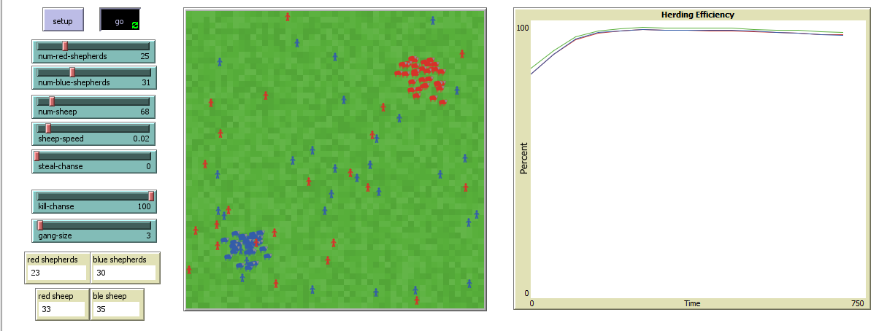
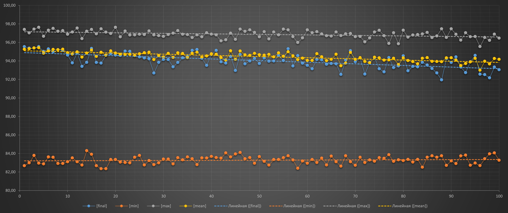

## Комп'ютерні системи імітаційного моделювання
## СПм-22-3, **Захаров Даніїл Олександрович**
### Лабораторна робота №**2**. Редагування імітаційних моделей у середовищі NetLogo

 

### Варіант 9, модель у середовищі NetLogo:
[Sheperds](http://www.netlogoweb.org/launch#http://www.netlogoweb.org/assets/modelslib/Sample%20Models/Biology/Shepherds.nlogo)
Поділити вівець на два різних стада, відповідно і пастухів на дві різні організації. Пастухи повинні збирати тільки "своїх" вівець. Додати відключаєму можливість збирати "чужих" вівець, які після потрапляння до нового стада змінюють свою приналежність

 

### Внесені зміни у вихідну логіку моделі, за варіантом:

**Створення двух організацій** на ігровому полі при ініціалізації моделі - спочатку був лише один вид пастухів.  
Замість
<pre>
breed [shepherds shepherd]
</pre>
було створено 2 види агентів пастухів:
<pre>
breed [shepherds1 shepherd1]
breed [shepherds2 shepherd2]
</pre>
До списку глобальних змінних було додано:
<pre>
blue-herding-efficiency     ;; ефективність групування синіх овець
red-herding-efficiency      ;; ефективність групування червоних овець
blue-sheep                  ;; кількість синіх овець
red-sheep                   ;; кількість червоних овець
</pre>
Тепер існують shepherds1-own shepherds2-own у яких до агентів було додано характеристику координатів їх загону:
<pre>
shepherds1-own
[
  carried-sheep
  found-herd?
  homex
  homey
]
shepherds2-own
[
  carried-sheep
  found-herd?
  homex
  homey
]
</pre>
Процедура **setup** також притерпіла змін

Тепер ініціалізуються два види пастухів з координатами їх загонів (15, 15) для червоних та (-15, -15) для синіх
<pre>
set-default-shape shepherds1 "person"
set-default-shape shepherds2 "person"

create-shepherds1 num-red-shepherds
[
  set homex 15
  set homey 15
  set color red
  set size 1.5
  set carried-sheep nobody
  set found-herd? false
  setxy random-xcor random-ycor 
]

create-shepherds2 num-blue-shepherds
[ 
  set homex -15
  set homey -15
  set color blue
  set size 1.5
  set carried-sheep nobody
  set found-herd? false
  setxy random-xcor random-ycor 
]
</pre>

Процедура **go** притерпіла значних змін

Раніше пастух шукав вівцю поки не тримав її у руках, після знаходження, блукав та залишав вівцю на вільному місці поблизу іншої вівці.

Відтепер пастухи мають іншу логіку. Пастух шукає вівцю тільки якщо він відійшов від загону на 5 ділянок, після знаходження вівці, він несе її прямо до загону та шукае вільне місце для неї, а потім шукае наступну вівцю.

Нова "логіка" пастухів:
<pre>
ask shepherds1
  [ 
    ifelse carried-sheep = nobody
    [ 
      ifelse sqrt(((homex - xcor) ^ 2) + ((homey - ycor) ^ 2)) > 5
      [search-for-sheep]
      [
        wiggle
        fd 1
      ]
    ]
    [ 
      ifelse found-herd?
      [ find-empty-spot ]
      [ find-new-herd ] 
    ]
    if carried-sheep != nobody
    [ ask carried-sheep [ move-to myself ] ] 
  ]
</pre>
У кінці процедри підраховуються кількості овець
<pre>
set blue-sheep count sheep with [color = blue]
set red-sheep count sheep with [color = red]
</pre>

Процедура **search-for-sheep**. Тепер пастух оцінює колір вівці, і підбирає її, якщо вона біла або її колір відповідає його кольору. Або може забрати вівцю протилежного кольору з вирогідністю, що задана новим вхідним параметром **steal-chanse**
<pre>
to search-for-sheep
  wiggle
  fd 1
  let personal-color color
  set carried-sheep one-of sheep-here with [not hidden? and (color = personal-color or color = white or (random 99) + 1 <= steal-chanse)]
  if (carried-sheep != nobody)
  [
    ask carried-sheep
    [ 
      set color personal-color
      hide-turtle
    ]
    fd 1 
  ]
end
</pre>

Процедура **find-new-herd**. Відтепер пастух слідує прямо до загіну за допомоги *face*. І вважается що він знайшов стадо якщо він у радіусі 2 ділянок від загіну.
<pre>
to find-new-herd
  let distance-to-target sqrt(((homex - xcor) ^ 2) + ((homey - ycor) ^ 2))
  face patch homex homey
  fd 1
  if distance-to-target <= 2
    [ set found-herd? true ]
end
</pre>

У процедурі **find-empty-spot**, на початок, було додано рядки:
<pre>
rt random 360
fd 1
</pre>
через те, що було змінено логіку переміщення пастухів. Так пастух знайде вільне місце та покине загін після переміщення вівці.

Також тепер у процедурі **calculate-herding-efficiency** обчислюються ефективності групування синіх та червоних овець.
<pre>
set red-herding-efficiency (sheepless-neighborhoods / (count patches with [not any? sheep-here with [color = red]])) * 100
set blue-herding-efficiency (sheepless-neighborhoods / (count patches with [not any? sheep-here with [color = blue]])) * 100
</pre>

 

### Внесені зміни у вихідну логіку моделі, на власний розсуд:

**Додано ймовірність вбити пастуха протилежної команди**.
Імовірність встановлюється користувачем через інтерфейс середовища моделювання (слайдери для **kill-chanse** та **gang-size**) та використовується у "логіці" пастуха:

Для червоних:
<pre>
if count shepherds2-on neighbors >= gang-size and ((random 99) + 1 <= kill-chanse)
[
  print "red shepherd died"
  die
]
</pre>

А для синіх:
<pre>
if count shepherds2-on neighbors >= gang-size and ((random 99) + 1 <= kill-chanse)
[
  print "red shepherd died"
  die
]
</pre>

Ці модифікації дописані в кінці обробки логіки кожного пастуха.
Якщо поряд з пастухом (8 оточуючих ділянок) знаходится кількість ворожих пастухів, що більша або дорівнює *gang-size* та випадає шанс *kill-chanse*, то пастух помре.

Скріншот моделі в процесі симуляції

Фінальний код моделі та її інтерфейс доступні за [посиланням](MyShepherds.nlogo). 
 

## Обчислювальний експеримент

### Вплив шансу вбивства на загальну ефективність групування
Досліджується залежність ефективності групування від шансу вбивства пастуха опонента. Експерименти проводяться при 25 пастухах у кожній команді, з 68 вівцями, їх швидкість 0.02, вівць красти не можна, усього 100 симуляцій, крок зміни шансу вбивста 1, кожна ітерація триває 3000 тактів.
Досліджується максимальне, мінімальне, середнє та фінальне значення ефективність групування

Статичні параметри:
- **sheep-speed**: 0.02
- **steal-chanse**: 0
- **num-sheep**: 68
- **num-blue-shepherds**: 25
- **gang-size**: 2
- **num-red-shepherds**: 25

<table>
    <tr>
        <td>kill-chanse</td>
        <td>[final]</td>
        <td>[min]</td>
        <td>[max]</td>
        <td>[mean]</td>
    </tr>
    <tr>
        <td>1</td>
        <td>95,53</td>
        <td>82,67</td>
        <td>97,39</td>
        <td>95,25</td>
    </tr>
    <tr>
        <td>2</td>
        <td>95,37</td>
        <td>82,98</td>
        <td>97,03</td>
        <td>95,30</td>
    </tr>
    <tr>
        <td>3</td>
        <td>95,38</td>
        <td>83,78</td>
        <td>97,43</td>
        <td>95,40</td>
    </tr>
    <tr>
        <td>4</td>
        <td>95,53</td>
        <td>82,95</td>
        <td>97,62</td>
        <td>95,42</td>
    </tr>
    <tr>
        <td>5</td>
        <td>95,02</td>
        <td>82,87</td>
        <td>96,65</td>
        <td>94,83</td>
    </tr>
    <tr>
        <td>6</td>
        <td>95,29</td>
        <td>83,62</td>
        <td>97,31</td>
        <td>95,07</td>
    </tr>
    <tr>
        <td>7</td>
        <td>94,97</td>
        <td>83,59</td>
        <td>97,50</td>
        <td>95,23</td>
    </tr>
    <tr>
        <td>8</td>
        <td>95,21</td>
        <td>82,91</td>
        <td>97,19</td>
        <td>95,20</td>
    </tr>
    <tr>
        <td>9</td>
        <td>95,13</td>
        <td>82,91</td>
        <td>97,26</td>
        <td>95,26</td>
    </tr>
    <tr>
        <td>10</td>
        <td>94,63</td>
        <td>83,10</td>
        <td>96,87</td>
        <td>94,88</td>
    </tr>
    <tr>
        <td>11</td>
        <td>93,78</td>
        <td>83,51</td>
        <td>97,12</td>
        <td>94,74</td>
    </tr>
    <tr>
        <td>12</td>
        <td>94,86</td>
        <td>83,10</td>
        <td>97,54</td>
        <td>94,97</td>
    </tr>
    <tr>
        <td>13</td>
        <td>93,40</td>
        <td>82,75</td>
        <td>96,40</td>
        <td>94,41</td>
    </tr>
    <tr>
        <td>14</td>
        <td>93,85</td>
        <td>84,30</td>
        <td>97,19</td>
        <td>94,85</td>
    </tr>
    <tr>
        <td>15</td>
        <td>95,34</td>
        <td>83,91</td>
        <td>97,39</td>
        <td>95,16</td>
    </tr>
    <tr>
        <td>16</td>
        <td>93,83</td>
        <td>82,67</td>
        <td>96,92</td>
        <td>94,48</td>
    </tr>
    <tr>
        <td>17</td>
        <td>93,75</td>
        <td>82,35</td>
        <td>97,46</td>
        <td>94,93</td>
    </tr>
    <tr>
        <td>18</td>
        <td>94,62</td>
        <td>82,35</td>
        <td>97,11</td>
        <td>94,62</td>
    </tr>
    <tr>
        <td>19</td>
        <td>94,77</td>
        <td>83,35</td>
        <td>96,96</td>
        <td>95,07</td>
    </tr>
    <tr>
        <td>20</td>
        <td>94,63</td>
        <td>83,34</td>
        <td>97,62</td>
        <td>94,84</td>
    </tr>
    <tr>
        <td>21</td>
        <td>94,59</td>
        <td>83,06</td>
        <td>96,59</td>
        <td>94,70</td>
    </tr>
    <tr>
        <td>22</td>
        <td>95,05</td>
        <td>83,02</td>
        <td>97,22</td>
        <td>94,68</td>
    </tr>
    <tr>
        <td>23</td>
        <td>95,02</td>
        <td>82,98</td>
        <td>96,80</td>
        <td>94,70</td>
    </tr>
    <tr>
        <td>24</td>
        <td>94,58</td>
        <td>83,59</td>
        <td>96,80</td>
        <td>94,59</td>
    </tr>
    <tr>
        <td>25</td>
        <td>94,42</td>
        <td>83,78</td>
        <td>96,88</td>
        <td>94,76</td>
    </tr>
    <tr>
        <td>26</td>
        <td>94,31</td>
        <td>82,75</td>
        <td>96,84</td>
        <td>94,88</td>
    </tr>
    <tr>
        <td>27</td>
        <td>94,22</td>
        <td>83,23</td>
        <td>97,23</td>
        <td>94,93</td>
    </tr>
    <tr>
        <td>28</td>
        <td>92,68</td>
        <td>82,79</td>
        <td>96,80</td>
        <td>94,14</td>
    </tr>
    <tr>
        <td>29</td>
        <td>93,84</td>
        <td>82,98</td>
        <td>96,72</td>
        <td>94,55</td>
    </tr>
    <tr>
        <td>30</td>
        <td>94,16</td>
        <td>83,39</td>
        <td>96,64</td>
        <td>94,42</td>
    </tr>
    <tr>
        <td>31</td>
        <td>94,14</td>
        <td>83,39</td>
        <td>96,84</td>
        <td>94,81</td>
    </tr>
    <tr>
        <td>32</td>
        <td>93,35</td>
        <td>82,87</td>
        <td>96,99</td>
        <td>94,37</td>
    </tr>
    <tr>
        <td>33</td>
        <td>93,82</td>
        <td>83,54</td>
        <td>97,26</td>
        <td>94,86</td>
    </tr>
    <tr>
        <td>34</td>
        <td>94,32</td>
        <td>83,31</td>
        <td>96,88</td>
        <td>94,80</td>
    </tr>
    <tr>
        <td>35</td>
        <td>94,47</td>
        <td>83,62</td>
        <td>96,84</td>
        <td>94,35</td>
    </tr>
    <tr>
        <td>36</td>
        <td>95,14</td>
        <td>83,43</td>
        <td>96,52</td>
        <td>94,82</td>
    </tr>
    <tr>
        <td>37</td>
        <td>95,22</td>
        <td>82,79</td>
        <td>96,80</td>
        <td>94,93</td>
    </tr>
    <tr>
        <td>38</td>
        <td>94,27</td>
        <td>83,51</td>
        <td>96,60</td>
        <td>94,39</td>
    </tr>
    <tr>
        <td>39</td>
        <td>93,52</td>
        <td>83,50</td>
        <td>97,03</td>
        <td>94,53</td>
    </tr>
    <tr>
        <td>40</td>
        <td>94,70</td>
        <td>83,68</td>
        <td>96,88</td>
        <td>94,76</td>
    </tr>
    <tr>
        <td>41</td>
        <td>95,14</td>
        <td>83,55</td>
        <td>96,80</td>
        <td>94,72</td>
    </tr>
    <tr>
        <td>42</td>
        <td>93,90</td>
        <td>83,50</td>
        <td>96,16</td>
        <td>94,36</td>
    </tr>
    <tr>
        <td>43</td>
        <td>93,76</td>
        <td>84,06</td>
        <td>96,28</td>
        <td>94,10</td>
    </tr>
    <tr>
        <td>44</td>
        <td>94,47</td>
        <td>83,62</td>
        <td>96,99</td>
        <td>95,09</td>
    </tr>
    <tr>
        <td>45</td>
        <td>92,97</td>
        <td>83,94</td>
        <td>96,33</td>
        <td>94,16</td>
    </tr>
    <tr>
        <td>46</td>
        <td>94,70</td>
        <td>84,10</td>
        <td>97,42</td>
        <td>95,06</td>
    </tr>
    <tr>
        <td>47</td>
        <td>93,68</td>
        <td>83,43</td>
        <td>97,19</td>
        <td>94,65</td>
    </tr>
    <tr>
        <td>48</td>
        <td>93,99</td>
        <td>83,55</td>
        <td>97,35</td>
        <td>94,58</td>
    </tr>
    <tr>
        <td>49</td>
        <td>94,27</td>
        <td>82,95</td>
        <td>97,07</td>
        <td>94,81</td>
    </tr>
    <tr>
        <td>50</td>
        <td>93,72</td>
        <td>83,66</td>
        <td>96,60</td>
        <td>94,66</td>
    </tr>
    <tr>
        <td>51</td>
        <td>94,31</td>
        <td>83,15</td>
        <td>97,15</td>
        <td>94,61</td>
    </tr>
    <tr>
        <td>52</td>
        <td>93,96</td>
        <td>82,75</td>
        <td>96,36</td>
        <td>94,70</td>
    </tr>
    <tr>
        <td>53</td>
        <td>93,99</td>
        <td>83,35</td>
        <td>97,11</td>
        <td>94,43</td>
    </tr>
    <tr>
        <td>54</td>
        <td>94,59</td>
        <td>83,34</td>
        <td>96,80</td>
        <td>94,87</td>
    </tr>
    <tr>
        <td>55</td>
        <td>94,03</td>
        <td>83,54</td>
        <td>97,43</td>
        <td>94,50</td>
    </tr>
    <tr>
        <td>56</td>
        <td>95,30</td>
        <td>83,74</td>
        <td>97,35</td>
        <td>94,98</td>
    </tr>
    <tr>
        <td>57</td>
        <td>93,44</td>
        <td>83,30</td>
        <td>96,60</td>
        <td>94,55</td>
    </tr>
    <tr>
        <td>58</td>
        <td>94,57</td>
        <td>82,39</td>
        <td>95,98</td>
        <td>94,13</td>
    </tr>
    <tr>
        <td>59</td>
        <td>93,75</td>
        <td>83,18</td>
        <td>96,48</td>
        <td>94,29</td>
    </tr>
    <tr>
        <td>60</td>
        <td>93,51</td>
        <td>82,95</td>
        <td>97,35</td>
        <td>94,05</td>
    </tr>
    <tr>
        <td>61</td>
        <td>93,15</td>
        <td>83,34</td>
        <td>97,03</td>
        <td>94,05</td>
    </tr>
    <tr>
        <td>62</td>
        <td>94,15</td>
        <td>83,02</td>
        <td>97,15</td>
        <td>94,77</td>
    </tr>
    <tr>
        <td>63</td>
        <td>94,11</td>
        <td>83,50</td>
        <td>96,91</td>
        <td>94,44</td>
    </tr>
    <tr>
        <td>64</td>
        <td>93,64</td>
        <td>82,75</td>
        <td>96,72</td>
        <td>94,02</td>
    </tr>
    <tr>
        <td>65</td>
        <td>93,72</td>
        <td>83,71</td>
        <td>96,68</td>
        <td>94,17</td>
    </tr>
    <tr>
        <td>66</td>
        <td>93,68</td>
        <td>83,10</td>
        <td>97,11</td>
        <td>94,72</td>
    </tr>
    <tr>
        <td>67</td>
        <td>92,53</td>
        <td>82,63</td>
        <td>96,72</td>
        <td>93,48</td>
    </tr>
    <tr>
        <td>68</td>
        <td>94,08</td>
        <td>83,75</td>
        <td>96,92</td>
        <td>93,76</td>
    </tr>
    <tr>
        <td>69</td>
        <td>95,10</td>
        <td>83,10</td>
        <td>96,95</td>
        <td>94,92</td>
    </tr>
    <tr>
        <td>70</td>
        <td>93,91</td>
        <td>82,72</td>
        <td>96,60</td>
        <td>94,17</td>
    </tr>
    <tr>
        <td>71</td>
        <td>94,31</td>
        <td>83,59</td>
        <td>96,64</td>
        <td>94,34</td>
    </tr>
    <tr>
        <td>72</td>
        <td>92,58</td>
        <td>83,02</td>
        <td>96,05</td>
        <td>93,93</td>
    </tr>
    <tr>
        <td>73</td>
        <td>93,84</td>
        <td>83,30</td>
        <td>96,47</td>
        <td>93,80</td>
    </tr>
    <tr>
        <td>74</td>
        <td>94,35</td>
        <td>83,16</td>
        <td>97,12</td>
        <td>94,39</td>
    </tr>
    <tr>
        <td>75</td>
        <td>93,15</td>
        <td>83,54</td>
        <td>97,30</td>
        <td>94,32</td>
    </tr>
    <tr>
        <td>76</td>
        <td>92,81</td>
        <td>83,46</td>
        <td>96,72</td>
        <td>94,08</td>
    </tr>
    <tr>
        <td>77</td>
        <td>94,34</td>
        <td>83,87</td>
        <td>95,88</td>
        <td>94,10</td>
    </tr>
    <tr>
        <td>78</td>
        <td>93,27</td>
        <td>83,15</td>
        <td>97,03</td>
        <td>94,27</td>
    </tr>
    <tr>
        <td>79</td>
        <td>93,45</td>
        <td>83,31</td>
        <td>95,85</td>
        <td>93,59</td>
    </tr>
    <tr>
        <td>80</td>
        <td>94,54</td>
        <td>83,23</td>
        <td>97,31</td>
        <td>94,32</td>
    </tr>
    <tr>
        <td>81</td>
        <td>92,93</td>
        <td>83,35</td>
        <td>96,56</td>
        <td>94,03</td>
    </tr>
    <tr>
        <td>82</td>
        <td>93,40</td>
        <td>83,07</td>
        <td>96,80</td>
        <td>93,92</td>
    </tr>
    <tr>
        <td>83</td>
        <td>93,35</td>
        <td>83,35</td>
        <td>96,84</td>
        <td>93,67</td>
    </tr>
    <tr>
        <td>84</td>
        <td>93,84</td>
        <td>82,51</td>
        <td>96,91</td>
        <td>94,28</td>
    </tr>
    <tr>
        <td>85</td>
        <td>93,55</td>
        <td>83,58</td>
        <td>97,07</td>
        <td>94,35</td>
    </tr>
    <tr>
        <td>86</td>
        <td>93,17</td>
        <td>83,75</td>
        <td>96,52</td>
        <td>93,94</td>
    </tr>
    <tr>
        <td>87</td>
        <td>92,70</td>
        <td>83,58</td>
        <td>96,68</td>
        <td>93,93</td>
    </tr>
    <tr>
        <td>88</td>
        <td>91,95</td>
        <td>83,74</td>
        <td>97,47</td>
        <td>93,91</td>
    </tr>
    <tr>
        <td>89</td>
        <td>94,27</td>
        <td>82,71</td>
        <td>96,52</td>
        <td>94,32</td>
    </tr>
    <tr>
        <td>90</td>
        <td>93,83</td>
        <td>83,19</td>
        <td>97,46</td>
        <td>94,33</td>
    </tr>
    <tr>
        <td>91</td>
        <td>94,43</td>
        <td>82,91</td>
        <td>96,87</td>
        <td>94,08</td>
    </tr>
    <tr>
        <td>92</td>
        <td>93,34</td>
        <td>83,73</td>
        <td>96,24</td>
        <td>93,50</td>
    </tr>
    <tr>
        <td>93</td>
        <td>92,74</td>
        <td>83,82</td>
        <td>97,03</td>
        <td>93,72</td>
    </tr>
    <tr>
        <td>94</td>
        <td>93,91</td>
        <td>82,72</td>
        <td>96,60</td>
        <td>93,89</td>
    </tr>
    <tr>
        <td>95</td>
        <td>94,58</td>
        <td>82,96</td>
        <td>96,64</td>
        <td>94,28</td>
    </tr>
    <tr>
        <td>96</td>
        <td>92,56</td>
        <td>82,68</td>
        <td>95,55</td>
        <td>93,00</td>
    </tr>
    <tr>
        <td>97</td>
        <td>92,52</td>
        <td>83,43</td>
        <td>96,53</td>
        <td>93,96</td>
    </tr>
    <tr>
        <td>98</td>
        <td>92,17</td>
        <td>83,96</td>
        <td>96,21</td>
        <td>93,67</td>
    </tr>
    <tr>
        <td>99</td>
        <td>93,33</td>
        <td>84,06</td>
        <td>96,88</td>
        <td>94,25</td>
    </tr>
    <tr>
        <td>100</td>
        <td>93,04</td>
        <td>83,27</td>
        <td>96,46</td>
        <td>94,16</td>
    </tr>
</table>

Графік наочно показує, що зі збльшенням шансу вбивсва, усім пастухам стає складніше підтримувати свої стада. Тобто вбивати - погано.
